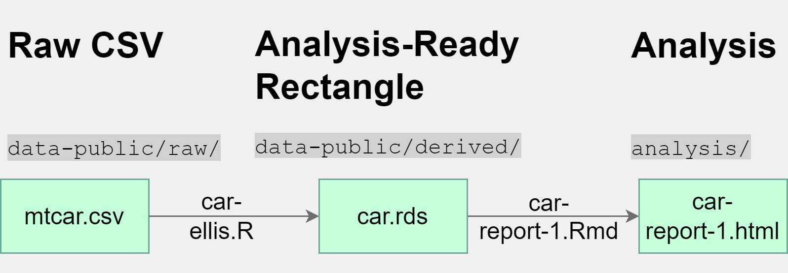
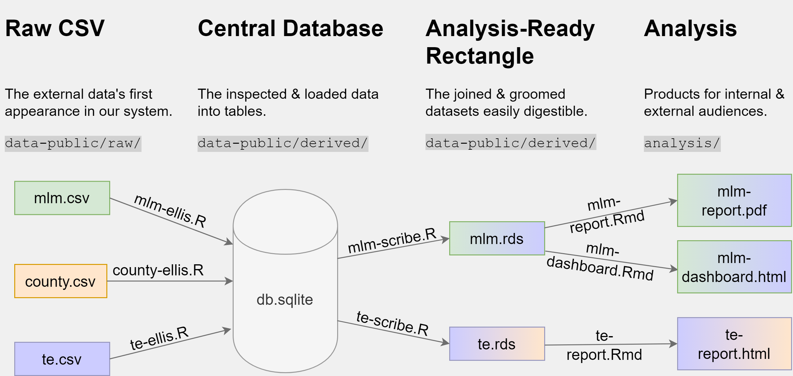
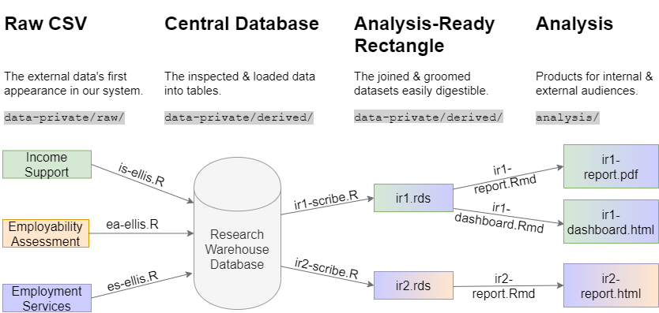

# `manipulation/` Directory

Files in this directory manipulate/groom/munge the project data.

They typically intake raw data from `./data-public/raw` and/or `./data-private/raw` and transform them into tidy objects, which would be convenient to place into literate scripts (e.g. `.Rmd` or `.qmd`) for exploration and annotation. For example, consider a simple project described in [RAnalysisSkeleton](https://github.com/wibeasley/RAnalysisSkeleton), featuring the ubiquitous `cars` data set:

The script `./manipulation/car-ellis.R` digests a raw `.csv` file from `./data-public/raw` and creates a clean data object `car.rds`, so-called *analysis-ready rectangle*. This object becomes the starting point for the literate script `./analysis/car-report-1/car-report-1.Rmd` which renders a self-contained document `car-report-1.hmtl` , the deliverable in this simple project. In this case, the [ellis and scribe patterns](https://ouhscbbmc.github.io/data-science-practices-1/patterns.html) are combined in the single script.

Please follow these [instructions](https://github.com/wibeasley/RAnalysisSkeleton#establishing-a-workstation-for-analysis) to execute the entire pipline of the RAnalysisSkeleton repo and examine `./analysis/car-report-1/car-report-1.html` for examples of code syntax for most basic tasks in data analysis. This template is useful for simple, one-off projects, like a straightforward information request with a quick turn-over.

However, a more realistic project involves multiple data sources and may call for separate tidy data sets to accommodate the specific requirement of a given task (e.g. feed into a statistical model vs serve as a data source for a dashboard). Consider the following example in which 20 children who live across three different counties are measured each year for 10 years on some physical and cognitive abilities to study their growth and to estimate how county characteristics (which are also measured each year) influence children's physical and mental growth.

We may want to explore county-level characteristics (`te.rds`) separtely from person-level characteristics (`mlm.rds`), hence two different rectangles, optimized for each task.

The resulting "derived" datasets produce less friction when analyzing. By centralizing most (and ideally all) of the manipulation code in one place, it's easier to determine how the data was changed before analyzing. It also reduces duplication of manipulation code, so analyses in different files are more consistent and understandable.

# GOA example 

It might be easier to think in terms of an example more relevant to our substantive focus:

