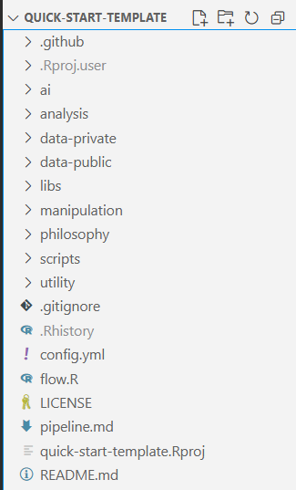
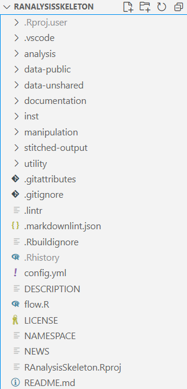

# Analysis Templatization

Modern data analysis must rely on template to scale up operations and ensure reproducibility, understandability, and scalability of research projects. This document provides an overview of the philosophy behind analysis templatization, its goals, and its components.

# Threats to Validity

To use the results of a data analysis as evidence in support of our views and decisions, we must address various **threats to validity** of conclusions drawn from the data.

**Threats to validity** refer to factors or issues that can compromise the accuracy, credibility, or generalizability of research findings. These threats can introduce biases or errors into the research process, leading to flawed conclusions or limited applicability of the results.

[Shadish, Cook, and Campbell (2002)](https://psycnet.apa.org/record/2002-17373-000) described four broad categories of validity threats:

Each of these broad categories can be further divided into specific threats, which we invite you to review [here](../../analysis/analysis-templatization/threats-to-validity.htm) or with the following prompt:

> Prompt: List specific threats to validity within each broad category described by (Shadish, Cook, and Campbell, 2002) .

Overall, the primary goal in a research study is to minimize these threats to ensure that the study's findings are both meaningful and applicable.

# Literate Programming

Since 2002 researchers and analysts expanded on this taxonomy, proposing new threats to validity that reflected and addressed concerns in the emerging environment of **big data** and **cheap computing**. Missing and inaccurate data, for example, became more relevant in analyses relying on *big observational data*, as opposed to those \[analyses\] working with neat data structures of randomized experiments. Other such threats included concerns related to data provenance (origin and collection), model overfitting, algorithm bias, reproducibility, and version control, to name a few. Big data also brought new challenges to the implementattion of data analysis.

> Prompt: [Shadish, Cook, and Campbell (2002)](https://psycnet.apa.org/record/2002-17373-000) describe four broad categories of threats to validity. What other threats to validity have been proposed since then? Make sure to include those arising from the rise of big data.

Larger, more complex data added more necessary layers of abstractions (relational structures, programming languages, mathematical models) to the practice of data analysis during a research activity and thus increased the "distance" a researcher must cover between the clear, verifiable **findings** in plain language and the proof for such claims supported by the **evidence** in the data.

One of the responses to new challenges was popularization of **literate programming**, a methodology which invites to view a program as a piece of literature, where the code is embedded within explanatory text, similar to a technical document or a research paper. Literate programming encourages programmers to write code and accompanying explanations in a coherent narrative, making it easier for others (including future selves) to understand the reasoning behind the code. It involves organizing code into logical sections or "chunks" and providing detailed explanations, motivations, and insights at each step. New software tools emerged to help with these tasks.

A popular tool for practicing literate programming is the "literate programming system" (e.g.,Jupyter Notebook, RStudio, noweb) that supports the integration of code and documentation. These tools allow data analysts and statisticians to write a document that combines code, mathematical formulas, explanatory text, and visualizations, all in a single coherent format. The challenges of this approach, however, include managing and organizing programming scripts of various lengths and purposes. This is what **templatization** aims to address.

# Templatization

Faced with the necessity to manage literate scripts to provide the evidence for analytic conclusions we encounter new conceptual and technical challenges related to reproducibility, version control, documentation structure, tooling, and collaboration in our research enterprise. We can distinguish two broad classes/levels of templates aimed to assist us in facing these challenges:

-   **Script-level**: These techniques and practices help us strike a balance between code and explanatory text, integrating meaningful narrative and reproducible evidence within individual scripts.

-   **Project-level**: These approaches and methods focus on packaging literate scripts to ensure reproducibility, understandability, and scalability of research projects.

## Script-Level

Script-level templates codify and embody various techniques and practices for authoring self-standing, monothematic analytic narratives. They encompass several aspects, including the mechanics of using the tool, chunk management, story composition, and the sequence of programming steps.

**Production Mechanics**: Script-level templates provide guidance on how to effectively use the chosen literate programming tool. They cover aspects such as creating and organizing the document, embedding code and explanatory text, formatting options, and compiling or executing the script to generate the desired output. These templates offer instructions and examples to help data analysts and statisticians navigate the tool's features and leverage them to create compelling and readable analytic narratives.

**Chunk Management**: Chunk management involves structuring the script by dividing it into logical sections or chunks. Script-level templates guide authors on how to determine the sequence and arrangement of these chunks. They provide recommendations on when to show or hide code and/or results, allowing authors to control the level of detail presented to the reader. Templates may also suggest best practices for chunk labeling, cross-referencing, and navigation, enhancing the overall user experience for readers of the script.

**Report Dramaturgy**: Report Dramaturgy refers to the structuring and composition of the report in a way that engages the reader, effectively communicates the analysis process, and conveys the significance of the findings. It involves applying principles of storytelling and narrative techniques to present the data analysis in a compelling and coherent manner. It is an art of arranging and organizing the elements of a analytic report to create a meaningful and impactful experience for the audience.

## Project-Level

Project-level templates provide a framework for organizing and structuring the collection of interconnected literate scripts, facilitating the management and dissemination of the project as a whole.

One function of project-level templates involves establishing **consistent conventions** for file organization, naming conventions, and folder structures. By adopting standardized practices, researchers can easily navigate and locate specific scripts or sections of code within the project. This organization enhances collaboration and makes it easier for others to understand and reproduce the research.

|                                                     |                                                       |
|----------------------------------------|--------------------------------|
| github.com/GovAlta/quick-start-template             | github.com/wibeasley/RAnalysisSkeleton                |
| {width="317"} | {width="318"} |

: Table: Two examples of templates for file architecture of reproducible projects

Additionally, project-level templates can include guidelines for managing **dependencies and software environments**. By documenting the specific versions of libraries, packages, and software used in the project, researchers can ensure that others can recreate the same computational environment. This is crucial for replicating results and fostering transparency in the research process.

Furthermore, project-level templates may incorporate **strategies for managing data** sources, including data preprocessing and cleaning procedures. By documenting the steps taken to transform raw data into analysis-ready datasets, researchers can ensure that the data processing pipeline is well-documented and reproducible. This allows others to understand and reproduce the data preparation steps, leading to transparent and reliable analysis.

In terms of **scalability**, project-level templates can provide guidance on structuring the project to accommodate larger datasets, additional analyses, or evolving research questions. This may involve **modularizing** the code into reusable functions or libraries, enabling researchers to build upon and extend the project over time without duplicating efforts. By adopting scalable practices, researchers can effectively manage complex and evolving projects.
