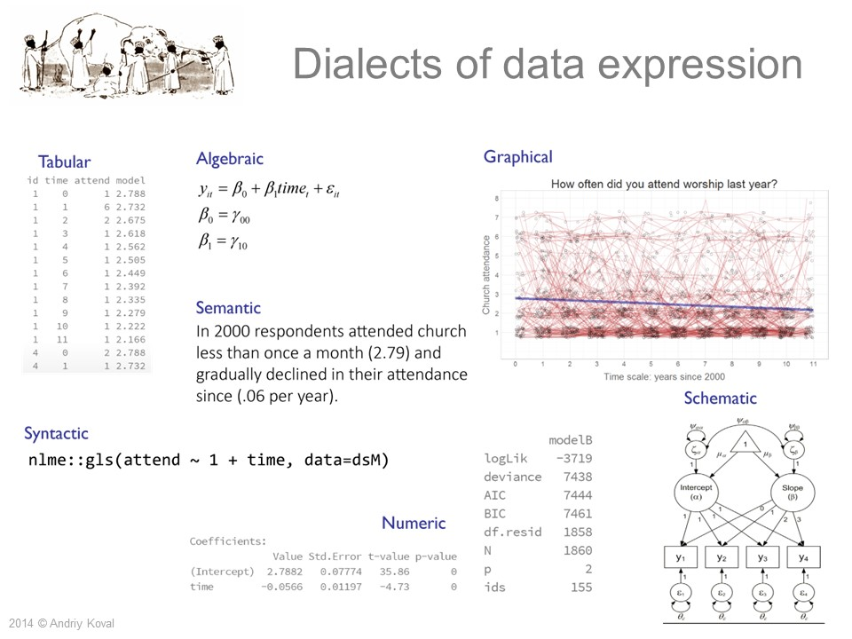

# Dialectical Epistemology in AI-Augmented Data Practice

© 2025 Andriy Koval

# Introduction: The Problem of Flattened Knowing

In the era of AI-augmented analysis, we risk reducing data science to a mechanical exercise—an over-reliance on efficiency, automation, and output without anchoring our inquiry in epistemic depth. The analyst is no longer just a modeler or coder but a meaning-maker across symbolic systems. Yet as AI becomes more capable of expressing and executing code, rendering graphs, and simulating narrative, we must ask: What is the human’s role in this process? What is lost when analysis is divorced from the dimensionality of real-world understanding?

This essay proposes a dialectical epistemology for human–AI collaboration—one that restores the analyst’s role as a conductor of meaning and positions AI as an agile translator across modes of data expression.

# Data as the Fabric of Reality

Rather than treating data as inert inputs to be manipulated, we begin with the idea that data is the fabric of reality—a structured presence that can be made manifest across different dimensions or cross-sections. These are not just formats; they are epistemic dialects, each revealing something different:
	•	Tabular: The raw grammar of structure.
	•	Algebraic: The syntax of models and relationships.
	•	Graphical: Intuition through visualization.
	•	Schematic: Theory embodied in form (e.g., DAGs, SEMs).
	•	Syntactic: Operationalized logic via code.
	•	Numeric: Inference and confidence.
	•	Semantic: Meaning rendered in human language.

Each dialect is a way of knowing. Each offers a slice of a multidimensional reality.

# The Analyst as Conductor

In this framework, the human analyst becomes a conductor of movement across dimensions. Analysis is no longer a linear act but a narrative arc that shifts attention between modalities. For example, one might begin with a tabular summary, discover a surprising pattern visually, formalize it algebraically, validate it numerically, and then communicate it semantically.

The value lies not in one dialect, but in the ability to move between them—to translate, contextualize, and refine understanding across representational forms.

# The Role of AI: Agile Polyglot, Not Oracle

AI fits into this epistemology as a polyglot translator and executor. It can:
	•	Convert models to code,
	•	Visualize structures from raw data,
	•	Translate results into semantic summaries,
	•	Generate schematic diagrams from narrative prompts.

Yet AI does not initiate purpose, theory, or ethics. It does not dwell in meaning. It moves fluently, but without agenda.

Thus, AI becomes a force-multiplier for analytic fluidity—but not a substitute for judgment, prioritization, or value-laden interpretation.

# Limits and Tensions

Some dialects—particularly semantic and schematic—remain deeply human:
	•	Semantic expression is rooted in culture, history, and stakes. AI can simulate fluency, but not situatedness.
	•	Schematic reasoning (e.g., DAGs) depends on theoretical commitments that AI can replicate, but not argue for autonomously.

Moreover, AI lacks a coherent sense of narrative arc—the intentional thread that binds analytic fragments into communicable insight.

# Toward a New Literacy

What this approach demands is a new literacy for analysts—not just technical skill, but modal fluency:
	•	Reading a table, a model, a diagram, and a narrative as parts of the same conversation.
	•	Moving with ease between code and commentary, inference and interpretation.
	•	Seeing AI not as a shortcut, but as a dialectical partner.

This is post-disciplinary, post-linear, and grounded in shared cognition.

# Conclusion

To work meaningfully with AI, we must stop asking what it can do for us and instead ask what it can do with us. The dialectical epistemology presented here provides a map: data as fabric, dialects as dimensions, humans as conductors, AI as translator.

In this view, analysis is not just a sequence of tasks—it is a multidimensional act of seeing, translating, and shaping reality. Let us treat it accordingly.

# Key Ideas

## Multidimensionality of Data
-  Data has multiple representational surfaces — tabular, visual, syntactic, semantic — each a projection of the same underlying essence into a different dimensionality (epistemic system).
- Aligns with modern epistemology and theoretical physics, which conceptualize complex systems as "slices" or "projections" in higher-dimensional spaces.

## Human-as-Conductor
- Human role in human–AI collaboration: interpretive conductor guiding attention across modalities.

## 	AI as Implementational Engine
- AI is tasked with enabling swift, accurate traversal and auditable implementation of analytic processes — not as decision-maker, but as amplifier and translator of the narrative arc produced by human analysts.

# Usefull metaphors

## Data as a Multidimensional Fabric of Reality 
- In the universe of a research project, for the purposes of collaboration with AI, it is useful to think of observed data as the fabric of reality, a structured presence that can be made manifest across different dimensions or cross-sections. These are not just formats; they are epistemic dialects, each revealing something different:
	- Tabular: The raw grammar of structure.
	- Algebraic: The syntax of models and relationships.
	- Graphical: Intuition through visualization.
	- Schematic: Theory embodied in form (e.g., DAGs, SEMs).
	- Syntactic: Operationalized logic via code.
	- Numeric: Inference and confidence.
	- Semantic: Meaning rendered in human language.
- This aligns with modern epistemology and theoretical physics, which conceptualize complex systems as "slices" or "projections" in higher-dimensional spaces.

## Data as a Language 

- Another way to think about data is by comparing it to language. The initial tabular data is the proto language, the language of creation, the Old Tongue, the language that cannot lie. It is perfectly accurate, but intensely specific. To be meaningful to humans, it needs to be translated into other languages (i.e. dialects of data expression). In other works, in needs to be simplified, guidedly distorted to render it meaningful in human terms.

This allows us to frame **data analysis** as a polyglot enterprise — expressing the reality written in the "true language of tabular data" into other dialects of data expression, each with its own strengths and limitations. Humans guide AI to implement this translation.

- **Tabular**: Raw numeric records, the native format of many data systems.
- **Algebraic**: Formal equations that define structure and relationships.
- **Graphical**: Visualization as a dialect—communicating trends and variation visually.
- **Schematic**: Diagrammatic models (e.g., SEM or HLM) that reveal theoretical scaffolding.
- **Semantic**: Plain-language translation that narrativizes patterns into social meaning.
- **Syntactic**: Code as expression—precise, executable representations of models.
- **Numeric**: Inferential statistics—quantified evidence for claims.

# Prompt for AI Collaboration

Dialectical Data Practice in Multidimensional Space

I approach data not just as numbers, but as the fabric of reality—a richly textured structure that can be made manifest in multiple dimensions or cross-sections. The human analyst conducts the dynamic shifts across these cross-sections, shaping an analytic narrative that reveals new patterns, relationships, and meanings. AI enables swift, accurate traversal across these views, and helps ground them in auditable, reproducible code.

The attached image —  — illustrates this mindset. It shows how a single empirical phenomenon can be expressed through multiple dialects:

- Tabular (raw observations),
- Algebraic (formal modeling),
- Graphical (visual intuition),
- Schematic (structural theory),
- Syntactic (code and execution),
- Numeric (quantified inference),
- Semantic (interpretive narration).

In our collaboration, I invite you to operate across these dialects:

- Translate insights into multiple formats;
- Clarify connections between code, model, and meaning;
- Move flexibly between data views—each one a slice of a higher-dimensional truth;
- Ensure every step is legible, auditable, and communicable to others.

This is not just technical work—it is a shared cognitive process. Treat every analytic task as a conversation between perspectives, and let AI serve as both guide and amplifier in that conversation.
