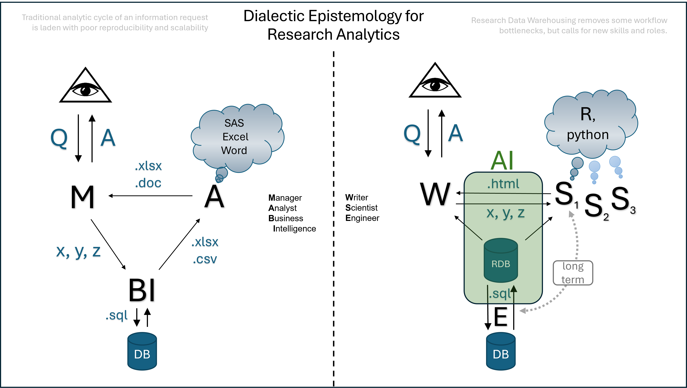

# Dialectical Epistemology for AI-augmented Research Analytics

## Table of Contents

-   [The Problem of Flattened Knowing](#introduction-the-problem-of-flattened-knowing)
-   [Useful Metaphors](#useful-metaphors)
    -   [Data as a Multidimensional Fabric of Reality](#data-as-a-multidimensional-fabric-of-reality)
    -   [Data as a Language](#data-as-a-language)
    -   [Human Analyst as Conductor](#human-analyst-as-conductor)
    -   [AI as a Polyglot](#ai-as-a-polyglot)
-   [Limits and Tensions](#limits-and-tensions)
-   [Toward a New Literacy](#toward-a-new-literacy)

# The Problem {#the-problem}

In the era of AI-augmented analysis, we risk reducing data science to a mechanical exercise - an over-reliance on efficiency, automation, and output without anchoring our inquiry in epistemic depth. The process of operating AI-augmented research analytic systems place new demands on human analysts, pushing them out of the role of statisticians and coders into a meaning-makers who navigate diverse representational dialects. Yet as AI becomes more capable of expressing and executing code, rendering graphs, and simulating narrative, we must ask: What is the human’s role in this process? What is lost when analysis is divorced from the dimensionality of real-world understanding?

This document describes a dialectical epistemology for human–AI collaboration,  establishing human's role as a conductor of meaning and positioning AI as an agile translator across modes of data expression.

# Useful Metaphors {#useful-metaphors}

## Data as a Multidimensional Fabric of Reality {#data-as-a-multidimensional-fabric-of-reality}

-   In the universe of a research project, for the purposes of collaboration with AI, it may be convenient to think of observed data as the fabric of reality, a structured information that can be made manifest across different dimensions or cross-sections. These are not just formats; they are epistemic dialects, each revealing something different about reality of data:
    -   **Tabular**: The raw grammar of structured data.
    -   **Algebraic**: The syntax of mathematical models and statistical relationships.
    -   **Graphical**: Intuition through visualization.
    -   **Schematic**: Theory embodied in form (e.g., DAGs, SEMs).
    -   **Syntactic**: Operationalized logic via code.
    -   **Numeric**: Evidence for Inference and quantify uncertainly.
    -   **Semantic**: Meaning rendered in human language.
-   This aligns with modern epistemology and theoretical physics, which conceptualize complex systems as "slices" or "projections" in higher-dimensional spaces.

## Data as a Language {#data-as-a-language}

-   **Lost in Translation.** Another way to think about data is by comparing it to language. The initial tabular data is the proto language, the language of creation, the Old Tongue, the language that cannot lie. It is perfectly accurate, but intensely specific. To be meaningful to humans, it needs to be translated into other languages (i.e. dialects of data expression), which would invariably lose nuance of the captured information. In other words, in needs to be simplified, guidedly distorted to render it meaningful in human terms.
-   **Lies, Damn Lies, and Statistics**. The inherent interpretive nature of meaning-making (i.ie. translation from the proto-language, statistical modeling, etc.) places obvious ethical responsibilities on the human analyst to protect the interest of the public, to the extent that their position in the organization proscribes.

This allows us to frame **data analysis** as a polyglot enterprise — expressing the reality written in the "true language of tabular data" into other dialects of data expression, each with its own strengths and limitations. Humans guide AI to implement this translation.

-   **Tabular**: Raw numeric records, the native format of many data systems.
-   **Algebraic**: Formal equations that define structure and relationships.
-   **Graphical**: Visualization as a dialect—communicating trends and variation visually.
-   **Schematic**: Diagrammatic models (e.g., SEM or HLM) that reveal theoretical scaffolding.
-   **Semantic**: Plain-language translation that narrativizes patterns into social meaning.
-   **Syntactic**: Code as expression—precise, executable representations of models.
-   **Numeric**: Inferential statistics—quantified evidence for claims.

## Human Analyst as Conductor {#human-analyst-as-conductor}

In [[philosophy/README]] (organization framework for AI-augmented research analytics), the human analyst operates as a conductor of movement across dimensions. Analysis is approached not as a linear act but a narrative arc that shifts attention between modalities as our inquiry unfolds. For example, one might begin with a tabular summary, discover a surprising pattern visually, formalize it algebraically, validate it numerically, and then communicate it semantically.

The added value lies not in mastery of one dialect (AI role), but in the ability to move between them (human role): to translate, contextualize, and refine understanding across representational forms.

## AI as a Polyglot {#ai-as-a-polyglot}

AI fits into this epistemology as a polyglot translator and executor. It can: • Convert models to code, • Visualize structures from raw data, • Translate results into semantic summaries, • Generate schematic diagrams from narrative prompts.

Yet AI does not initiate purpose, theory, or ethics. It does not dwell in meaning. It moves fluently, but without agenda.

Thus, AI becomes a force-multiplier for analytic fluidity—but not a substitute for judgment, prioritization, or value-laden interpretation.

# Limits and Tensions {#limits-and-tensions}

Some dialects, particularly semantic and schematic, remain deeply human:

• Semantic expression is rooted in culture, history, and stakes. AI can simulate fluency, but not situatedness.\
• Schematic reasoning (e.g., DAGs) depends on theoretical commitments that AI can replicate, but not argue for autonomously.\
• Most importantly, AI lacks a coherent sense of the narrative arc of the research project, the intentional thread that binds analytic fragments into communicable insight.

# Toward a New Literacy {#toward-a-new-literacy}

What this approach demands is a new literacy for analysts: not just technical skill needed to operate within a given competency, but modal fluency:

• Reading a table, a model, a diagram, and a narrative as parts of the same conversation.\
• Moving with ease between code and commentary, inference and interpretation.\
• Seeing AI not as a shortcut, but as a dialectical partner.

Knowledge is a  conversation, emergent from discussion between humans. We employ AI as a polyglot to translate across dialects of data expression, but humans remain the conductors of meaning, flawed but ultimattely accountable for the ethical and epistemic integrity of the research enterprise.

